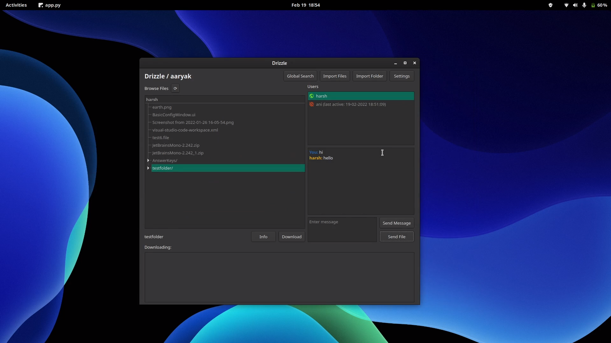
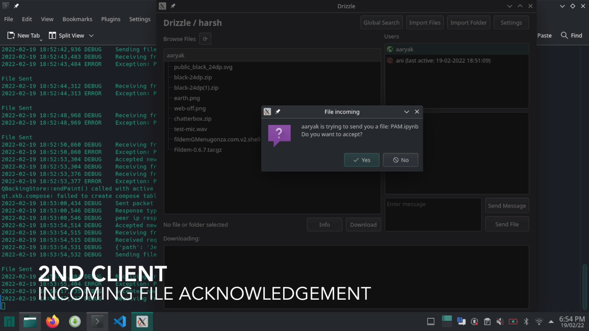

# Drizzle

_Drizzle is a lightweight file-sharing and messaging platform inspired by DC++._\
[See the feature list](https://github.com/hs2361/Drizzle/edit/gui/README.md#features)

[Demonstration Video (file)](./docs/media/Drizzle_Final.mp4)

https://user-images.githubusercontent.com/56076061/154854653-22287ddf-0cdd-4334-b60b-21f8c1c12f9d.mp4

## The Team

-   [Harsh Sharma](https://github.com/hs2361)
-   [Aaryak Shah](https://github.com/aaryak-shah)
-   [Anirudh Gautam](https://github.com/gautamanirudh)

## Technologies Used

-   Python
-   Sockets
-   Qt Framework

## Thoughts Behind the Project

Drizzle is inspired by the DC++ project, a popular file sharing application. This project aims to provide a far simpler and easy to navigate user experience for high performance file sharing. It attempts to make a cross compatible, lightweight application that's easy to deploy and use on local networks, making it useful for using over college networks.

## Features

### See Who's Online 🌐

View all users on the network, whether they are online or not, and when they were last active.

### Chat (P2P) 💬

Drizzle provides a fast, peer-to-peer private messaging service.

### Direct File Transfer (P2P) 📄

Send files directly to other users on the network. For security purposes, recepients are able to choose whether or not to receive such files.

### Browsing and Search 🔍

Easily browse through available files and directories for online users. Looking for something specific but don't know who has the file? Drizzle lets you search the entire network for files and directories.

### Download Files and Folders (P2P) 💾

Select files and even entire directories of your choice and download them onto your computer. Drizzle will make a direct connection with the owner of the file and begin the download.

### Pause and Play (P2P) ⏯️

File and folder downloads may be paused at any time. This halts the download process, while keeping the incomplete files in a hidden temp folder. Downloads can be resumed at a later stage to obtain the rest of the data (As long as the file owner is online).

Going offline? Drizzle will save your progress between sessions so you can restart the application and still resume your downloads.

### Corruption Detection and Tamper-proofing ⚠️

The Drizzle server keeps track of file hashes for medium and large files. When you download such files, Drizzle will calculate the hash on the received data and perform an integrity check to ensure the file was not corrupted or tampered with during the transfer.

### Share Only What You Want To ✅

Drizzle works with a designated `Share Folder` that contains the files and folders that you wish to make public on the network. Files outside this folder cannot be accessed by other peers.

### Storage Optimisation ⚡

Adding new shareable files into the `Share Folder` by means of copying them is not ideal and leads to unnecessary usage of disk space. Drizzle lets you import files and folders into your `Share Folder` by making `Symbolic Links` to save your disk storage.

### Desktop Notifications 🚨

Get notified if you receive a message or when a file is done downloading. (Of course, you can turn these off)

## Installation

Clone this repository

```sh
git clone https://github.com/hs2361/Drizzle.git
cd Drizzle
```

### Dependencies

-   python &geq; 3.10
-   pyqt5
-   msgpack
-   tinydb [server]
-   fuzzysearch [server]
-   notify-py [client]

### Server Setup

The server needs to be run on only one computer on the network.

```sh
cd src
python -m server.server
# ensure that Python version is 3.10 or higher
```

The server will display a line on startup with the IP assigned to it. Use this IP when starting new clients on the network.

```
SERVER IP: xxx.xxx.xxx.xxx
```

### Client Setup

The server needs to be run on only one computer on the network.

```sh
# create necessary folders
mkdir ~/.Drizzle/db ~/.Drizzle/logs ~/.Drizzle/tmp ~/.Drizzle/share
```

```sh
cd src/client
python app.py
# ensure that python is using version 3.10 or higher
```

---

### Install And Run With Pipenv

```sh
# create necessary folders
mkdir ~/.Drizzle/db ~/.Drizzle/logs ~/.Drizzle/tmp ~/.Drizzle/share
```

**Server:**

```sh
cd src/server
pipenv install
pipenv run python server.py
```

**Client:**

```sh
cd src/client
pipenv install
pipenv run python app.py
```

> Note: Running the app inside a pipenv may prevent it from accessing the OS's active theme and may use some default styling.

## Platform Support

### GNU/Linux

**Complete feature support.** All functionalities should work as intended on a Linux machine and between Linux peers.

### Windows, OS-X

You may notice some problems when using peers running Windows or OS-X. Some known issues are:

-   Pause/Resume is not supported
-   Glitched UI components on OS-X
-   Symlink imports need admin on Windows
-   Potential for unpredictable behaviour

## Architecture

Drizzle uses a hybrid architecture, utilizing both peer-too-peer and client-server patterns.

### The Server

The Drizzle server is a simple data hub to make it easier to find information about the users on the network. It serves to keep track of which users are connected on the network as well as what files they have set up for sharing. Additionally the server stores some metadata for the files such as the file size and file hash.

The server does not have any other responsibilities as the other functionality is entirely peer-to-peer. This means that the server does not need to handle too much traffic, making it feasible to be setup in a home environment.

### Client-Server Communication

A client-server communication happens for the following usecases:

-   Register username with server (on client startup)
-   Update client's share folder data on server
-   Request an IP against a known username
-   Request a username against a known IP
-   Obtain share folder data for a user
-   Get file search results for the network
-   Update file hashes on server

### Peer-To-Peer Communication

Peers on the network discover each other (in terms of usernames and IPs) through the server. Once this data is received, however, peer-to-peer connections can be established as and when required. Thus, many of the succeeding functionalities are handled directly between the peers:

-   Requesting files and folders
-   Pause/Resume
-   Sending files
-   Private messaging

## Screenshots







